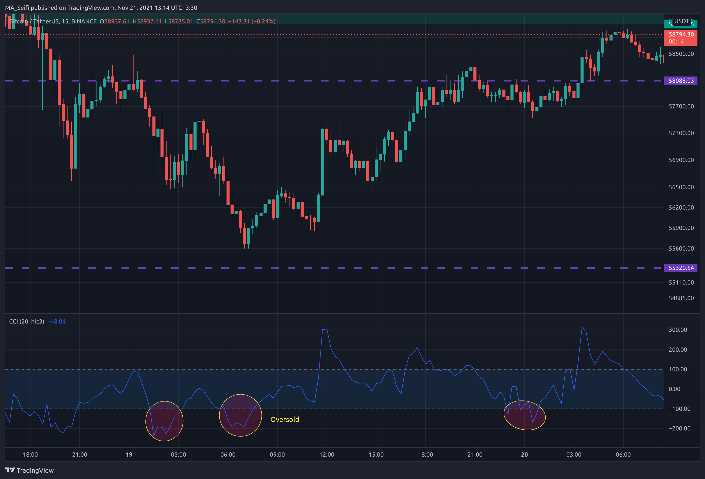
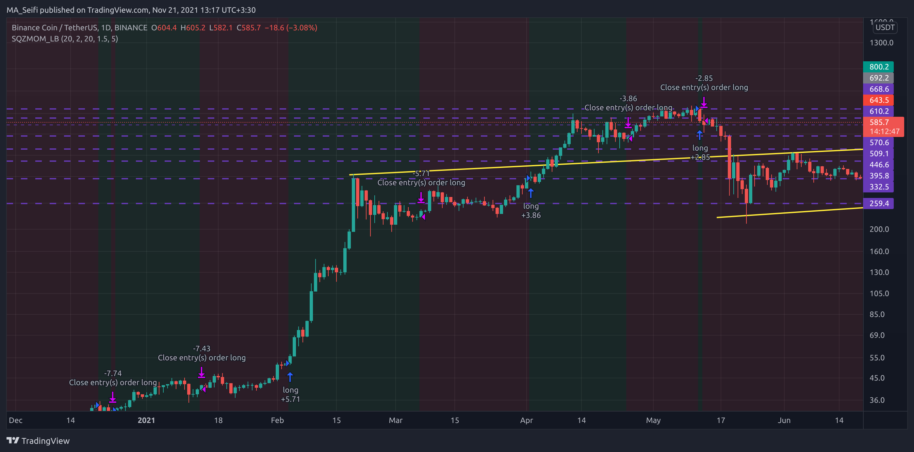
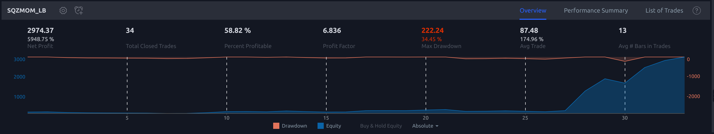

# Auto-Trading-Bot

### Motivation
> My motivation for this project is to make a bot that trades for you. 
> Therefore, you don't need to check the chart yourself and spend your time every day.

### How can I start the bot?
> Same as the other trading systems, this bot also needs a good strategy to get a good profit at the end of the month or week.
> I wrote two strategies by myself for the default option but if you are a trader, absolutely your strategy works better than mine.

### How can I write a strategy?
> If you know Python programming language, write your strategy by getting real-time market data from IEXCloud and access indicators by TAAPI service.
> If you know Pine script, write your strategy and connect it with BVA to let this script access alerts that come from TradingView. 

## Requirements
1. [Beautiful soup](https://www.crummy.com/software/BeautifulSoup/bs4/doc/)
2. [Python Telegram bot](https://python-telegram-bot.readthedocs.io/en/stable/)
3. [Requests](https://docs.python-requests.org/en/latest/)
4. [Requests-HTML](https://docs.python-requests.org/projects/requests-html/en/latest/)
5. [Pyppeteer](https://miyakogi.github.io/pyppeteer/)

## Core Data
This package is for getting data from web.
- ### IEXCloud
    > Stocks, forex, crypto, and more. A core set of financial data all in one place, so you can focus on building.
    
    IEX Cloud is a platform that makes financial data and services accessible to everyone.  
    IEXCloud Main URL: https://iexcloud.io/  
    IEXCloud API Documentation URL: https://iexcloud.io/docs/api
- ### TAAPI
    > TAAPI.IO is a straightforward REST API and price data provider for fetching popular Technical Analysis (TA) Indicator Data.
  
    TAAPI.IO is a developer-friendly API that provides investors and traders easy and
    automated access to technical analysis data. With TAAPI.IO, you get easy access to
    the most popular (MA, RSI, MACD, etc.) and advanced indicators on crypto and other securities.  
    TAAPI Main URL: https://taapi.io/  
    TAAPI Indicators API Documentation URL: https://taapi.io/indicators/

## Exchange
This package is for placing a new limit/market order and open positions which your strategy let that.
- ### KuCoin
    > KuCoin is a global cryptocurrency exchange for numerous digital assets and cryptocurrencies. Launched in September 2017, KuCoin has grown to become one of the most popular crypto exchanges and already has 8 million registered users across 207 countries and regions around the world.
  
    KuCoin URL: https://kucoin.com

## Notification
This package sends you some alerts, position openings, unrealised PNL, the balance of your account, and sth like this.
It's also for an emergency position close and such that.
- ### Telegram
  > Telegram is a cloud-based mobile and desktop messaging app with a focus on security and speed.
  
  As I mentioned, by this package this bot can connect Telegram and send alerts for you or in your channel.

## Release
By this package you can define a setup for your strategy, assign it a name and collect every messy you wrote in different packages into one release package.
- ### Heisen
  As I love [Heisenberg](https://en.wikipedia.org/wiki/Werner_Heisenberg), I chose this name for my first strategy.
    This Package gets some connections, opens some files to write data, processes the messages you sent from Telegram, has an off button, and does different things that you should try.

## Signal
This package is for getting signals from your strategy.
- ### BVA
  > Our goal is to democratize access to the best crypto trading algorithms.
  
  When you wrote your strategy on [Trading View](https://www.tradingview.com/), you can connect yours with [BVA](https://bitcoinvsalts.com/) and then connect this bot with that.

## Strategy
The heart part of the project is here. let go through that.
- ### CCI
    
  This strategy as that name suggests works with the the [Commodity channel index](https://www.investopedia.com/terms/c/commoditychannelindex.asp) indicator.
  The reward/risk ratio of this strategy is 0.5. it works only when the CCI value comes below the -100 horizontal line, so it opens a long position and waits for the price to touch the target.
  The appropriate time frame for this strategy is 5m/15m. Warning that it's long-only.
  Actually, this strategy works when the price is oversold at the mentioned time frames.
- ### Squeeze Momentum
    
  I wrote this strategy by the Squeeze Momentum Indicator which [LazyBear](https://www.tradingview.com/u/LazyBear/) created.  
  This is a derivative of John Carter's "TTM Squeeze" volatility indicator, as discussed in his book "Mastering the Trade" (chapter 11).  
  Black crosses on the midline show that the market just entered a squeeze ( Bollinger Bands are with in Keltner Channel). This signifies low volatility , market preparing itself for an explosive move (up or down). Gray crosses signify "Squeeze release". 
  Mr.Carter suggests waiting till the first gray after a black cross, and taking a position in the direction of the momentum (for ex., if momentum value is above zero, go long). Exit the position when the momentum changes (increase or decrease --- signified by a color change). 
  More info:
  Book: Mastering The Trade by John F Carter.  
  
  